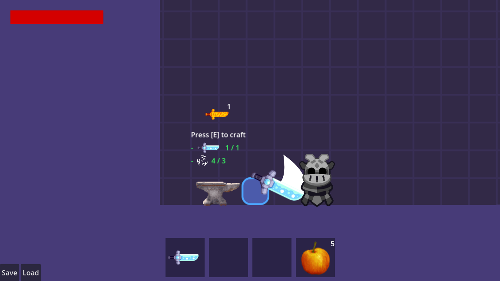
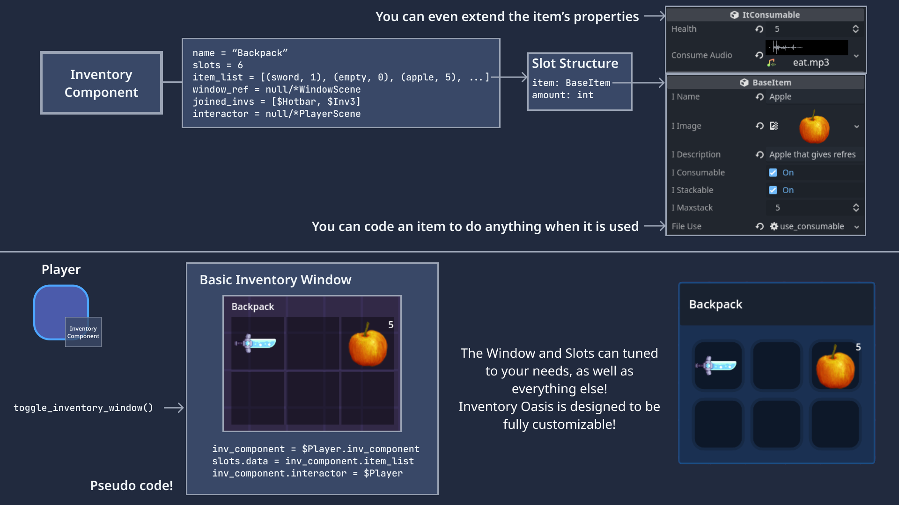
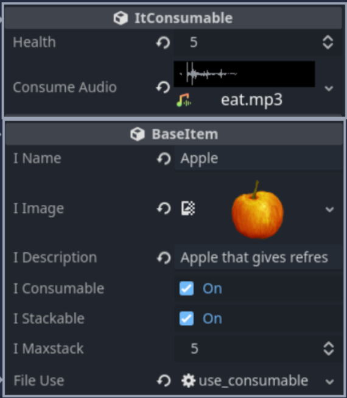
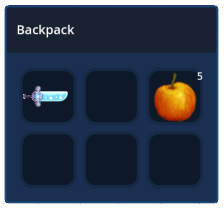

# Inventory Oasis: Upgraded Version Available

## Attention, fellow developers!

I am thrilled to announce the upgraded version of this inventory system, now known as Inventory Oasis! This powerful inventory system has been revamped to offer even more functionality and seamless integration with Godot 4.  This system is tightly integrated with the engine, providing an awesome user experience. With Inventory Oasis, you can manage your inventory with ease, adding and editing items directly through the Inspector.

One of the key benefits of Inventory Oasis is its flexibility. Every 
item can be extended with custom properties and custom use functions, 
allowing you to tailor the system to your specific needs. This means you
 can easily add new item types or modify existing ones to fit your 
workflow.

Thanks to the close integration with the Godot 4 engine, Inventory 
Oasis provides a seamless experience for game developers and designers.
 Whether you're building a 2D or 3D game, you can take advantage of 
Inventory Oasis's powerful features to manage your game assets with 
ease.

We hope that you find Inventory Oasis to be a valuable addition to your
 game development toolkit. Whether you're a seasoned developer or just 
getting started with Godot 4, Inventory Oasis can help you streamline 
your workflow and create amazing games.

## Upgrading to Inventory Oasis

For an enhanced experience consider upgrading to [Inventory Oasis](https://whimfoome.itch.io/inventory-oasis).

[DOCUMENTATION](https://inventory-oasis.github.io/docs/intro)

### Get the legacy version

If you decide you don't want to upgrade, you can still use the legacy version for Godot 3.X through the [`gd-3.x branch`](https://github.com/Whimfoome/godot-InventorySystem/tree/gd-3.x)
